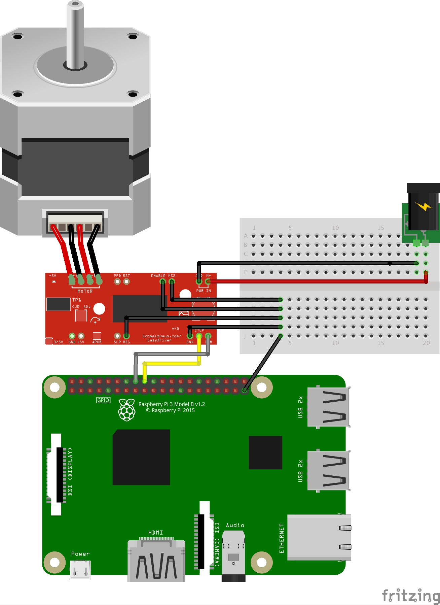

# easydriver_for_python


## 1. What's the this repository?
This repo is stepper motor driver **easy driver**'s repo.

easy driver is [this](https://www.sparkfun.com/products/12779) <- Jump to sparkfun.

## 2. Repuirements
Requirements parts is this.
- Raspberry pi3 :strawberry:
- easydriver :car:
- stepper motor (Driving at 6V to 30V) :point_up:
- AC adaptor (Voltage that meets the requirements of stepper motor) :zap::zap::zap:
- jumper wire :arrows_counterclockwise:

## 3. How to connect?
Connect example this.


## 4. Pin details
This table is diverted to [my blog](http://hatobus.hatenablog.jp/entry/2017/10/31/203757).

This table using japanese.(Sorry :sweat_smile::sweat_smile::pray::pray::pray::pray:)
| ピン名 | 用途 | 
|:-----------:|:------------|
| PWR IN (GND / M+)       | モータへ電源を供給する(Promote power supply) |
| STEP     | 立ち上がりエッジでモーターが動く，パルス幅1ms min. (pulse width)    |
| DIR      | 回転方向を決定(Deside moving direction) | 
| MS1, MS2 | マイクロステップの設定。デフォルトは共にプルアップされており、1/8ステップ。(Configuration for micro steps default is pull-up each other and 1/8 steps.)|
| ENABLE | HIGHにすると出力が止まる.今回はずっとLOW (If this pin HIGH able to stop stepper motor.) | 
| RST | 全シーケンスをHome Stateに設定,出力は停止,Reset端子がHighになるまでStep入力は無視 (All sequence set to Home State, Output is stop. To ignore will HIGH to Reset pins) |
|PFD|次の出力電流が前回より少なくなる場合,PFDピンへの入力で電流の抜け方が変化.VCCにプルアップされているので slow decay modeになっている。とりあえず非接続でよい (Don't attach)|
|SLP|Sleep機能,非接続でよい (sleep pins)|
|MOTOR	|モーターに接続する。A/Bがそれぞれ一組 (Attach to stepper motor)|
|5V|5V出力(5V's output)|
|APWR (SJ1)	|ここをショートさせると外部からA3967へVCCを給電できる (If this pin shorted, able to promote VCC to A3967 from outside. |
|3V/5V (SJ2)|VCC設定。ショートさせると3.3V, オープンだと5Vになる (VCC setting if this pin shorted to 3.3V, open is 5V. )|
|TP1|電流調整 (Adjustment to current.) |

- For bipolar stepping motors
- Input voltage is 8 V to 30 V (5 V system), 6.4 V to 30 V (3.3 V system)
- Output up to 30 V, 150 to 750 mA
- 1/1, 1/2, 1/4, 1/8 micro step operation supported
- No special power supply sequence required
- Through current prevention, heat prevention, low voltage protection (of chip)

## Program
### function
#### Drive
this is to rotate stepper motor.

```rotate.py 
def Drive(self, rpm):
    one_rot = 200
    l = rpm * one_rot
    delay = 30/(2*float(l))
    steps = l/6 #rotato to 5 sec
    for x in range(1,steps):
        GPIO.output(24,GPIO.HIGH)
        time.sleep(delay)
        GPIO.output(24,GPIO.LOW)
        time.sleep(delay)
```

`Drive(YOURVALUE)` YOURVALUE is int value(50~200). motor is rotate this YOURVALUE per minutes (rpm).
Default rotate time is 5 seconds.

```rotate.py
def inv_Direction(self):
    GPIO.output(23, not GPIO.input(23))
```

`inv_Direction` is inverse motor direction. To inverse direction is `DIR`pin state will inverse.(HIGH -> LOW or LOW -> HIGH)

